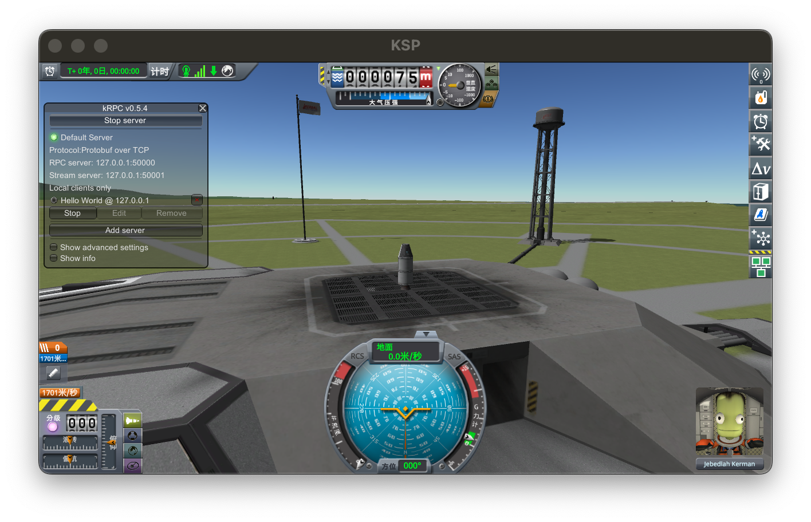

# KSP-Playground
A KSP spacecraft controller algorithm playground based on KRPC, aimed at reviewing algorithms from basic PID control to advanced MPC. The ultimate goal is to achieve automated rocket operations in the game, including launch, orbit insertion, recovery, and lunar landing.

## Hello world!
reference: https://krpc.github.io/krpc/index.html

### Environment
python environment
```bash
conda create -n ksp python=3.10
conda activate ksp
pip install ipykernel
pip install google-api-python-client
```
kerbal space program environment
1. github release 下载 krpc-x.x.x.zip (server)
2. download krpc-python-x.x.x.zip (krpc lib)
3. unzip server, 复制gamedata/* 到 KSP gamedata/，KSP位置通过steam browse local file确认
4. 解压 krpc python，详情见 file structure
5. 打开 KSP，sandbox (unlock all techniques)
6. add krpc server -> start
7. 游戏中进入 space center （必须进入才能成功）
8. 代码 connect -> KSP allow connect
9. 代码控制

file structure
```bash
KSP-Playground
    |- code
        |- 01-hello_world.ipynb
    |- krpc-0.5.4
    |- .gitignore
    |- README.md
```
### ScreeShot
